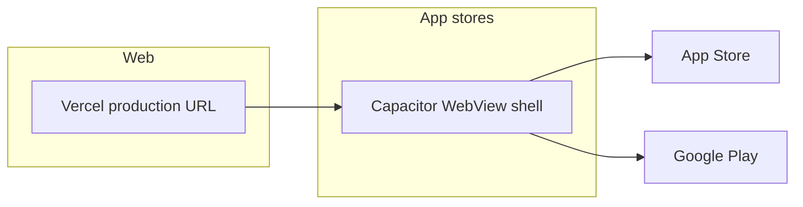

# Milestone — 14-day launch plan

Target: **Web + Apple App Store + Google Play** by **June 11, 2026** (2 weeks from May 28).

## Current state

| Area | Status |
|------|--------|
| Web app (Next.js 15 + Neon/Drizzle + NextAuth) | Core flows work: auth, dashboard, goals, kill list, groups, CRM, AI assistant |
| PWA manifest | Present (`public/manifest.json`) — no service worker yet |
| Native iOS / Android | **Not started** — use Capacitor hybrid shell (see `mobile/`) |
| Mobile UX | Sidebar-only layout — **mobile nav added in this branch** |
| Legal (privacy / terms) | **Required for stores** — pages at `/privacy`, `/terms` |
| Production domain | Set `NEXT_PUBLIC_SITE_URL` on Vercel + custom domain |

## Strategy: one codebase, three surfaces



Ship the **same** Next.js app on Vercel. Store apps are thin native wrappers that load your production URL (no React Native rewrite in 2 weeks).

**Trade-off:** Store apps need network for SSR; offline is limited. Acceptable for v1; add a service worker later if needed.

---

## Week 1 — Ship-ready web + accounts

### Day 1–2: Accounts & production URL

- [ ] **Apple Developer Program** ($99/yr) — [developer.apple.com](https://developer.apple.com/programs/)
- [ ] **Google Play Console** ($25 one-time) — [play.google.com/console](https://play.google.com/console)
- [ ] **Neon production database** — create the project, copy the pooled `DATABASE_URL`
- [ ] **Vercel production** — import repo; set `DATABASE_URL`, `AUTH_SECRET`, and
  (optional) `ANTHROPIC_API_KEY`; deploy
- [ ] **Apply the schema** to the production DB: `DATABASE_URL="<prod>" npm run db:push`
- [ ] **Custom domain** (e.g. `milestone.app` or `getmilestone.com`) — DNS → Vercel
- [ ] Set `NEXT_PUBLIC_SITE_URL=https://your-domain.com` in Vercel production

### Day 3–4: Product polish for reviewers

- [ ] Test signup → dashboard → create goal → complete milestone on **phone** (Safari + Chrome)
- [ ] Hide or remove “Coming soon” from **store screenshots** (Timeline / Templates / AI can stay in app if labeled beta)
- [ ] Settings: link Privacy & Terms (done in this branch)
- [ ] Support email in store listing and privacy page (e.g. `support@yourdomain.com`)

### Day 5–7: Store assets & legal

- [ ] **Privacy policy** live at `https://your-domain.com/privacy` (template in repo — customize & legal review)
- [ ] **Terms** at `https://your-domain.com/terms`
- [ ] **App icon** 1024×1024 (no transparency for Apple)
- [ ] **Screenshots**: 6.7" iPhone, 6.5" iPhone, phone Android (1080×1920 or Play specs)
- [ ] **Short description** (80 chars) + **full description** (4000 chars)
- [ ] **Age rating** questionnaire (likely 4+ / Everyone)
- [ ] **Data safety** form (Google) — declare email, user content, auth

---

## Week 2 — Native shells & submission

### Day 8–9: Capacitor builds

From `mobile/README.md`:

1. Set `CAPACITOR_SERVER_URL` to production HTTPS URL
2. `npm install` in `mobile/`
3. `npx cap add ios` / `npx cap add android` (on Mac for iOS)
4. Open Xcode / Android Studio, set bundle ID `com.yourcompany.milestone`
5. Test login + dashboard on simulator and physical device

### Day 10–11: Store listings

**Apple App Store Connect**

- [ ] Create app, bundle ID, SKU
- [ ] Upload build via Xcode Archive → Distribute
- [ ] App Privacy labels (match privacy policy)
- [ ] Export compliance: typically “No” for HTTPS-only apps without custom encryption

**Google Play**

- [ ] Create app, default language
- [ ] Upload AAB (Android App Bundle)
- [ ] Content rating (IARC questionnaire)
- [ ] Target API level per Play policy (check current year requirement)

### Day 12–13: Submit for review

- [ ] **Apple**: Submit for review (often 24–48h; first rejection is common — budget 1 resubmit)
- [ ] **Google**: Roll out to internal testing → production (review often faster than Apple)
- [ ] **Web**: Announce — Product Hunt, email, social; ensure `robots.txt` / SEO if public marketing site needed

### Day 14: Launch

- [ ] Apple approved → release manually or automatic
- [ ] Google production rollout
- [ ] Web live at custom domain
- [ ] Monitor Neon database metrics and Vercel runtime logs

---

## Review risks (mitigate early)

| Risk | Mitigation |
|------|------------|
| “App is just a website” (Apple 4.2) | Native shell + safe areas; optional biometrics later; ensure fast, app-like UX on mobile |
| Broken auth in WebView | Email/password works; if adding Google OAuth, configure a custom URL scheme + NextAuth callback URL |
| Missing privacy URL | `/privacy` must be public, linked in App Store Connect |
| Placeholder content | Don’t screenshot “Coming soon” pages as primary flows |
| Service role key in client | **Rotate to anon key before public launch** — current cloud dev uses admin key; production must use `anon` only |

---

## Optional (post-launch)

- Service worker + offline shell (PWA)
- Push notifications (Capacitor + FCM / APNs)
- React Native rewrite only if hybrid limits growth
- In-app purchases / subscriptions (StoreKit / Play Billing)

---

## Commands reference

```bash
npm run build          # Web production build
npm run lint && npm run typecheck
cd mobile && npm install && npx cap sync
```

## Owner checklist (you must do outside the repo)

1. Pay Apple + Google developer fees  
2. Choose and buy domain  
3. Legal review of privacy/terms text  
4. Create App Store Connect + Play Console listings  
5. Build & upload from Mac (iOS) and any machine (Android)  
6. Use a dedicated production Neon database and a strong `AUTH_SECRET` (never reuse dev secrets)
